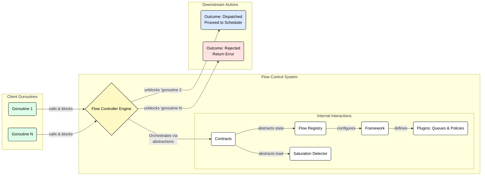

# Flow Control Module

## Introduction

In a multi-tenant, heterogeneous inference serving environment, managing diverse SLOs and fairness requirements is
critical. Today, the serving stack often relies on a simple "best-effort" or FIFO (First-In, First-Out) basis for
handling requests. This is insufficient and leads to significant problems:

* **Head-of-Line Blocking**: A long-running, low-priority request can block short, high-priority requests, violating
  SLOs.
* **Lack of Predictability**: Without proper queuing and prioritization, it's impossible to provide predictable latency
  guarantees to different tenants.
* **Inability to Handle Saturation**: Under heavy load, the system has no graceful way to manage overload, leading to
  cascading failures instead of controlled degradation.

The Flow Controller is a sophisticated library designed to solve these problems. It acts as a crucial gatekeeper that
decides *if* and *when* a request should proceed to be scheduled. Its primary mission is to enable predictable, fair,
and efficient utilization of shared backend resources by enforcing prioritization, applying fairness policies, managing
request queuing under saturation, and orchestrating displacement (the eviction of lower-priority queued items to make
space for higher-priority ones).

It is designed for extensibility, allowing custom logic for policies and queuing mechanisms to be plugged into a robust,
high-performance orchestration engine.

### Role in the Gateway API Inference Extension

Within the Gateway API Inference Extension's Endpoint Picker (EPP), the Flow Controller acts as a crucial gatekeeper
between the Routing and Scheduling layers. It decides *if* and *when* a request, already assigned to a logical flow
(e.g., a specific workload or tenant), should proceed to be scheduled onto a backend resource. It is the primary
mechanism for managing diverse SLOs, ensuring fairness among competing workloads, and maintaining system stability under
high load.

### Enabling, disabling, and tuning

Flow control is disabled by default and is enabled explicitly, via the `flowControl` feature gate
in the EPP config:

```yaml
featureGates: ["flowControl"]
```

With the gate off, the legacy saturation-only admission path is used. With it on, saturation no
longer pushes excess requests into each model server's local queue: they wait in the EPP and
dispatch by priority as capacity frees, with queue wait bounded by a TTL. Sheddable
(negative-priority) requests buffer under the same TTL and capacity rules instead of being
rejected immediately on saturation. Enabling the layer changes queueing behavior under load, so
review the tuning knobs below as part of turning it on.

Setting a `flowControl:` config section while the gate is disabled logs a warning: everything in it
except `saturationDetector` (which the legacy admission path also uses) is ignored.

Operationally, dispatch decisions depend on fresh endpoint metrics: saturation detection reads the
model-server metrics that the EPP's own data layer scrapes from endpoints. Endpoints whose metrics
are older than the detector's `metricsStalenessThreshold` count as fully saturated, so if the EPP
loses its scrape path to all endpoints (network policy, metrics port change, a starved refresh
loop), dispatch halts and queued requests eventually shed at their TTL. Keep the refresh interval
comfortably inside the staleness threshold and monitor scrape health when running with flow
control on.

Tuning knobs, all under the `flowControl:` config section:

* Per-band `maxRequests` / `maxBytes` — the shedding knobs. Lower them to reject excess load at the
  queue boundary instead of buffering it (for example, to approximate the legacy immediate-shed
  behavior for sheddable traffic).
* `defaultRequestTTL` — the queue-wait budget against a pool that has endpoints, and the other way a
  request is shed. Keep it under the client or gateway deadline, and size it to the time-to-first-token
  budget you are willing to spend waiting on a saturated pool. Priority-band entries and templates
  may replace the global value, including with `0s` for unbounded queue wait. Clients may request a
  shorter TTL with `x-llm-d-inference-ttl` using Go duration syntax. A positive header also sets a TTL
  when the selected band uses `0s`. The header cannot extend a finite configured TTL. These TTLs apply
  while the pool has endpoints. When the pool is empty, `noEndpointRequestTTL` controls how long
  requests wait.
* `noEndpointRequestTTL` — the queue-wait budget that replaces `defaultRequestTTL` while the pool has
  no endpoints, where the queue acts as a scale-from-zero waiting room. Left unset it follows
  `defaultRequestTTL`, so splitting the regimes is opt-in. Size it above pod startup (image pull plus
  weight load) if you want requests to survive a cold start; a request shed here is reported as
  `EvictedNoEndpoints` and returns 503 rather than 429. Which budget applies is
  re-evaluated while a request is queued, so a pool that scales up moves its queued requests onto
  `defaultRequestTTL`. A long budget only helps if the caller waits, so pair it with a gateway request
  timeout at least as long.
* The priority-holdback usage-limit policy — a gating knob, not a shedding one. It lowers the
  admission ceiling for low-priority traffic as utilization rises, so that traffic waits in queue
  rather than being rejected; it sheds only by way of the two limits above. Configure it via
  `usageLimitPolicyPluginRef`.

### High Level Architecture

The following diagram illustrates the high-level dependency model and request flow for the system. It shows how
concurrent client requests are managed by the central `FlowController`, which in turn relies on a set of decoupled
components to make its decisions. Each component package in this module will contain its own more detailed architectural
diagrams.



## Architectural Pillars

The Flow Controller framework is built on several key components that work in concert. This architecture is designed to
be highly modular and scalable, with clear separation of concerns. For a deep dive into the specific design choices and
their justifications, please refer to the detailed documentation within the relevant sub-packages.

1.  **The `FlowController` Engine (`./controller`)**: The central, orchestrator responsible for the main request
    processing loop. It manages a worker that distributes incoming requests, apply policies, and dispatch
    requests to the backends. Its design focuses on high throughput and backpressure.

2.  **Pluggable `Policy` Contracts (`/pkg/epp/framework/interface/flowcontrol`)**: The plugin SDK defines the core
    interfaces for all pluggable logic. It features a two-tier policy system for `Fairness` (decisions *between*
    different flows) and `Ordering` (decisions *within* a single flow) logic, covering both request dispatch and
    displacement.

3.  **The `SafeQueue` (`./contracts`, `./queue`)**: The `contracts.SafeQueue` interface defines concurrent-safe
    request storage, and `./queue` provides the priority-queue implementation whose dispatch order is determined by
    the flow's configured `OrderingPolicy`.

4.  **The `FlowRegistry` (`./registry`, `./contracts`)**: This is the stateful control plane of the system. It manages
    the configuration and lifecycle of all flows, policies, and queues. It presents a view of its state to the
    `FlowController` worker.

5.  **Core Types and Service Contracts (`./types`, `./contracts`)**: These packages define the foundational data
    structures (e.g., `FlowControlRequest`), errors, and service interfaces that decouple the engine from its
    dependencies, following a "Ports and Adapters" architectural style.
